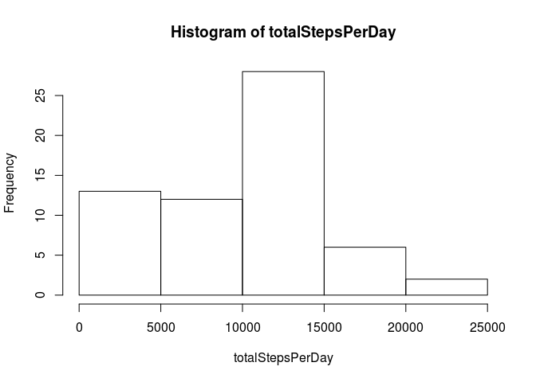
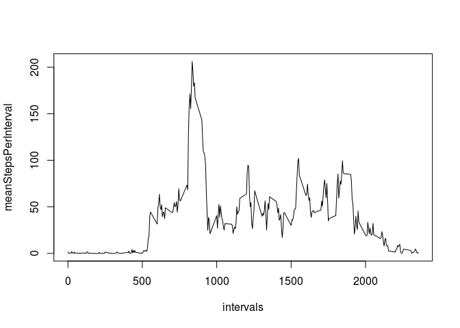
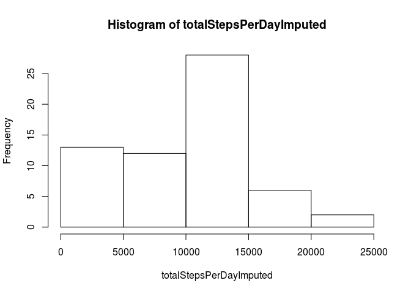
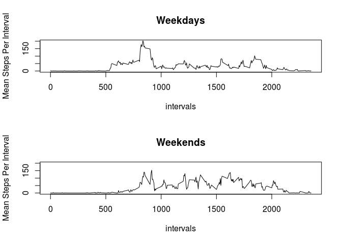
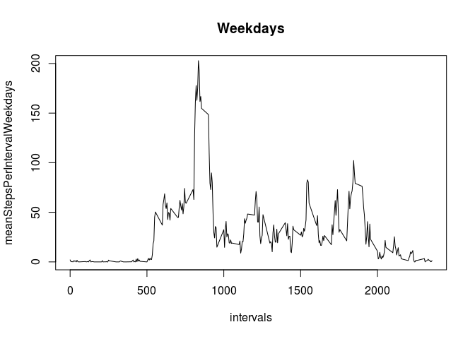

# Reproducible Research: Peer Assessment 1


## Loading and preprocessing the data


```r
unzip("activity.zip")
activity <- read.csv("activity.csv")
```

## What is mean total number of steps taken per day?


```r
totalStepsPerDay <- by(activity$steps, activity$date, function(x) sum(x, na.rm=TRUE))

hist(totalStepsPerDay)
```

 

```r
meanSteps <- mean(totalStepsPerDay)
medianSteps <- median(totalStepsPerDay)
```
The mean total number of steps per day was approximately 9354.23. 
The median total number of steps per day was 10395.

## What is the average daily activity pattern?

```r
meanStepsPerInterval <- by(activity$steps, activity$interval, function(x) mean(x, na.rm=TRUE))

intervals <- unique(activity$interval)

plot(intervals,meanStepsPerInterval,type="l")
```

 

```r
maxInterval <- intervals[which.max(meanStepsPerInterval)]
```

The 5-minute interval with the highest mean number of steps starts at 835.

## Imputing missing values


```r
nMissing <- sum(is.na(activity$steps))
```

There are 2304 rows with missing values in the dataset.

I implemented the following strategy for imputing the missing values:  
1. All missing step counts at time 0 are assigned zero steps.  
2. All subsequent missing step counts at time $i$ are assigned the same value
as time $i-1$.  


```r
# Apply imputation method described above
stepsImputed <- vector(mode="numeric",length=nrow(activity))
for (i in seq_along(stepsImputed)){
  if (is.na(activity$steps[i]) && i == 1){
    stepsImputed[i] <- 0
  }
  else if (is.na(activity$steps[i])){
    stepsImputed[i] <- stepsImputed[i-1]
  }
  else if (!is.na(activity$steps[i])){
    stepsImputed[i] <- activity$steps[i]
    }
}
# Generate new data frame with steps replaced by imputed values.
activityImputed <- activity
activityImputed[,1] <- stepsImputed
# Verify that there are no more missing values. 
nMissingImputed <- sum(is.na(activityImputed$steps))
```

After imputation, there are 0 missing values.


```r
totalStepsPerDayImputed <- by(activityImputed$steps, activityImputed$date, function(x) sum(x))

hist(totalStepsPerDayImputed)
```

 

```r
meanStepsImputed <- mean(totalStepsPerDayImputed)
medianStepsImputed <- median(totalStepsPerDayImputed)
```

After imputation, the mean total number of steps per day
was approximately 9354.23. 
The median total number of steps per day was 10395.  

This is the same distribution as before imputation, when
the missing values were discarded. This implies that the
method described above replaced all of the missing values
zeroes and thus did not affect the daily sums.


## Are there differences in activity patterns between weekdays and weekends?


```r
# Assign weekend or weekday labels
dayLabels <- weekdays(as.Date(activity$date))
weekdayLabels <- vector(mode="character",length=length(dayLabels))
for (i in seq_along(dayLabels)){
  if (dayLabels[i] == "Saturday" || dayLabels[i] == "Sunday"){
    weekdayLabels[i] <- "weekend"
    }
  else {
    weekdayLabels[i] <- "weekday"
    }  
  }

# Convert char vector to factor
weekdayLabels <- factor(weekdayLabels) 

# Append new column to data frame
activityImputed <- data.frame(activityImputed, weekdayLabels)

meanStepsPerIntervalWeekdays <- by(activityImputed$steps[weekdayLabels == "weekday"], activityImputed$interval[weekdayLabels == "weekday"], function(x) mean(x, na.rm=TRUE))

meanStepsPerIntervalWeekends <- by(activityImputed$steps[weekdayLabels == "weekend"], activityImputed$interval[weekdayLabels == "weekend"], function(x) mean(x, na.rm=TRUE))

plot(intervals,meanStepsPerIntervalWeekdays,type="l", ylim=c(0, 200))
title("Weekdays")
```

 

```r
plot(intervals,meanStepsPerIntervalWeekends,type="l", ylim=c(0, 200))
title("Weekends")
```

 

Compared to the weekday distribution, the weekend distribution has less prominent morning and evening peaks.
